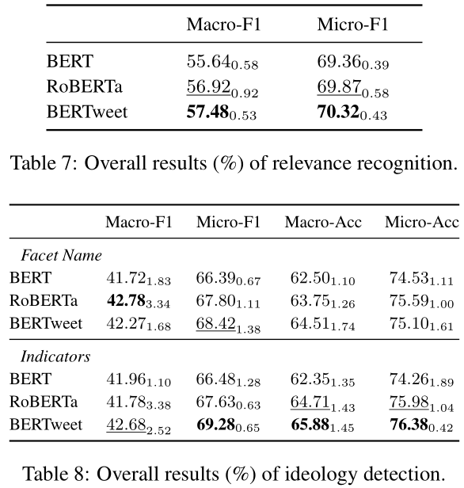
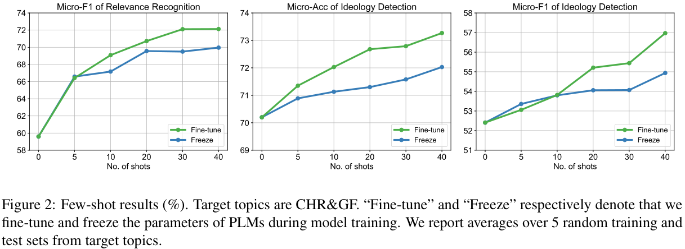

# MITweet

Ideology Takes Multiple Looks: A High-Quality Dataset for Multifaceted Ideology Detection (EMNLP 2023)

## Multifaceted Ideology Schema

The multifaceted ideology schema contains **five domains** that reflect different aspects of society. Under the five domains, there are **twelve facets** with ideological attributes of left- and right-leaning.


<center><p>Multifaceted Ideology Schema</p></center>


<p align="center">Illustration of Multifaceted Ideology Schema</p>

## The MITweet Dataset

Based on the schema, we construct a new high-quality dataset, **MITweet**, for a new **multifaceted ideology detection (MID)** task. MITweet contains **12,594** English Twitter posts, each manually annotated with a Relevance label, and an Ideology label if the Relevance label is “Related”, along each facet. Meanwhile, MITweet covers 14 highly controversial topics in recent years (e.g., abortion, covid-19 and Russo-Ukrainian war).

### Label Distribution


## Baselines

we develop baselines for the new MID task based on three widely-used PLMs (BERT, RoBERTa, BERTweet)  under both **in-topic** and **cross-topic** settings. We split the multifaceted ideology detection procedure into two sub-tasks in a pipeline manner:

1. **Relevance Recognition**
2. **Ideology Detection**

### In-topic Setting



### Cross-topic Setting



## Reproduce

We provide the dataset and code for reproducing.

In the directory  `data` ,  `MITweet.csv`  is the complete dataset.

Each  `.csv`  data file contains the following columns: 

- `topic`
- `tweet`

- `tokenized tweet`  : tokenized tweets using the tweet segmentation tool in nltk
- `R1` ~ `R5` : relevance labels for the 5 domains.  `1`  means "Related",  `0`  means "Unelated"
- `R1-1-1` ~ `R512-5-3` : relevance labels for the 12 facets.  `1`  means "Related",  `0`  means "Unrelated"
- `I1` ~ `I12` : ideology labels for the 12 facets.  `0` , `1` , `2`  mean left-leaning, center, right-leaning, respectively.  `-1`  means "Unrelated", so no ideology label

### How to Run

- **Indicator Detection**

  ```
  python log_odds_ratio.py
  ```

- **Relevance Recognition**

  ```
  python train_relevance.py \
  	--train_data_path your_path \
  	--val_data_path your_path \
  	--test_data_path your_path
  ```

- **Ideology Detection**

  ```
  python train_ideology.py \
  	--train_data_path your_path \
  	--val_data_path your_path \
  	--test_data_path your_path \
  	--indicator_file_path your_path
  ```
